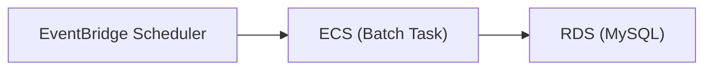

# Housework Hub (HwHub) - Batch

## 概要

このリポジトリは、Housework Hub (HwHub) の **バッチ処理基盤** を提供します。

主に以下のような **定期実行ジョブ** を担当します：

- 家事タスクの定期生成
- 家事タスクの再計算
- 招待の期限切れ処理
- その他、非同期・定期実行系の業務処理

実行基盤：

- Spring Boot + Spring Batch
- ECS Fargate
- EventBridge Scheduler によるスケジューリング

---

## アーキテクチャ概要



---

## ディレクトリ構成

```
src/main/java/com/hwhub/batch
├── application/
│   └── service/           # サービス層（ビジネスロジックの実行）
├── config/                # 各種設定クラス
├── domain/                # ビジネスルール
│   ├── enums/             # コードマスタ由来の Enum（※編集禁止）
│   ├── model/             # ドメインモデル
│   └── repository/        # リポジトリIF
└── infrastructure/        # 外部接続実装（DB, S3等）
    └── mybatis/
        ├── converter/     # Entity ⇔ Domain Modelの変換
        ├── generated/     # MBG自動生成（※編集禁止）
        │   ├── entity/
        │   └── mapper/
        ├── custom/        # 手書きEntity/Mapper（JOIN用など）
        │   ├── entity/
        │   └── mapper/
        └── repository/    # リポジトリ実装
```

構成方針は **バックエンドと同一思想（DDD + レイヤード）** です。

---

## ローカル開発環境のセットアップ

### 前提

- Java 21
- Docker
- MySQL（backend と同じ DB を使用）

---

## ローカルでの起動方法（単発実行）

特定のジョブを指定して実行：

```bash
./gradlew bootRun --args='--spring.batch.job.name=invitationExpireJob'
./gradlew bootRun --args='--spring.batch.job.name=houseworkTaskGenerateJob'
./gradlew bootRun --args='--spring.batch.job.name=houseworkTaskRecalcJob'
./gradlew bootRun --args='--spring.batch.job.name=householdCleanupJob'
./gradlew bootRun --args='--spring.batch.job.name=notificationAggregationJob'
```

---`

## ジョブ一覧（例）

- invitationExpireJob：招待の期限切れ処理
- houseworkTaskGenerateJob：家事タスクの定期生成
- houseworkTaskRecalcJob：家事タスクの再計算
- householdCleanupJob：世帯の削除
- notificationAggregationJob：通知イベントの集約

---

## テストの実行方法

```bash
./gradlew test
```

カバレッジレポート：

```bash
./gradlew test jacocoTestReport
```

出力先：

build/reports/jacoco/test/html/index.html

---

## CI（GitHub Actions）

- main ブランチ push 時：
  - テスト実行
  - JaCoCo カバレッジ計測
  - GitHub Pages にレポート公開

---

## ECS / 本番実行の仕組み

- コンテナイメージは ECR に push
- ECS タスク定義を更新
- EventBridge Scheduler が **TaskDefinition + Container Override** でジョブを起動

---

## EventBridge Scheduler での実行方式

1 つの TaskDefinition を使い、Scheduler 側で：

- Container override.command

を上書きして、実行ジョブを切り替えています。

---

## デプロイフロー（stg）
デプロイ先の環境はEphemeral STGとしているためPull Request前にterraform applyし環境を立ち上げておくこと

1. main ブランチに push
2. GitHub Actions が：
   - build
   - test
   - docker build & push
   - ECS タスク定義更新 ※Schedulerは最新を参照

---

## 運用時の確認ポイント

- EventBridge Scheduler の実行履歴
- ECS タスクの CloudWatch Logs
- 失敗時は CloudTrail の RunTask エラーを確認

---

## 注意事項

- バッチは **冪等性前提** で設計すること
- 途中失敗時に再実行しても問題ない設計にすること

---
